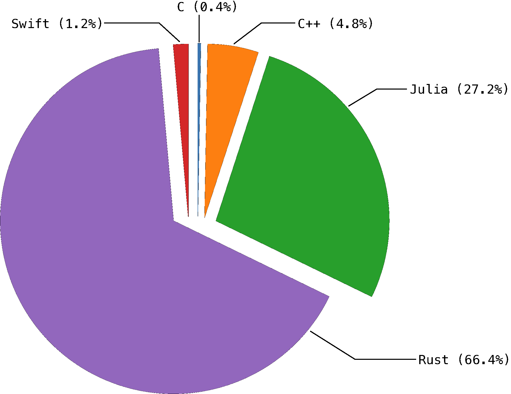
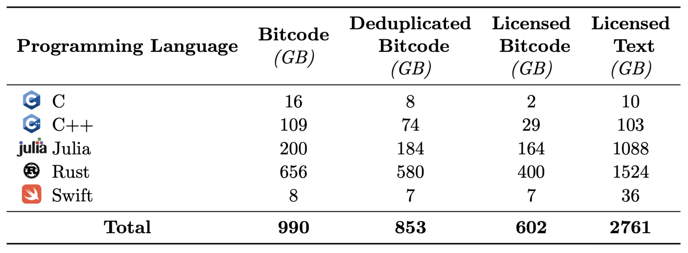
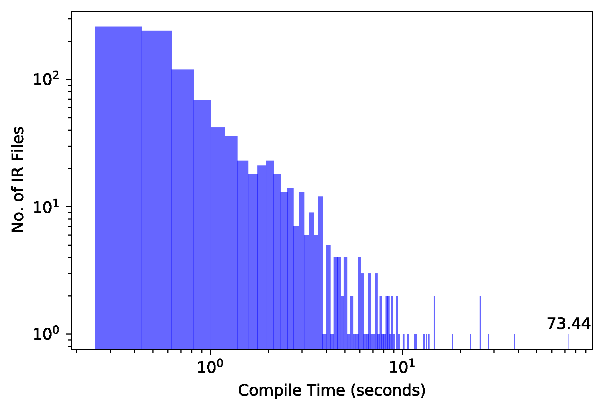
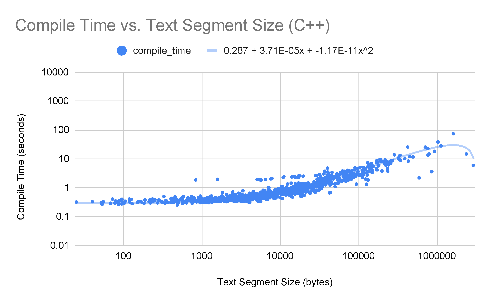
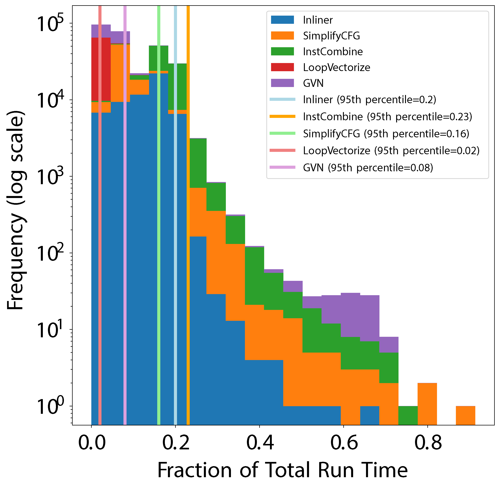
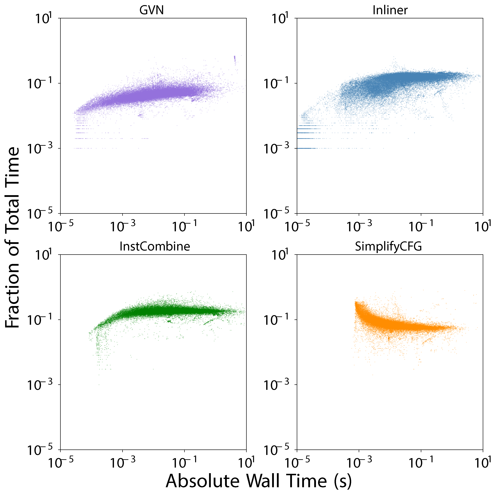
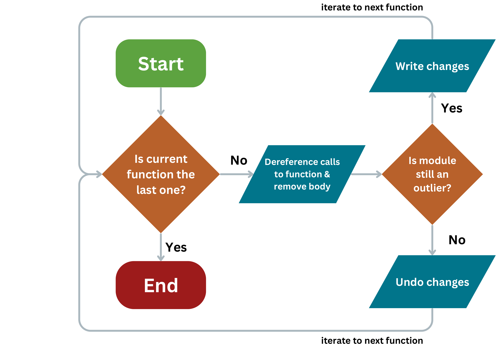
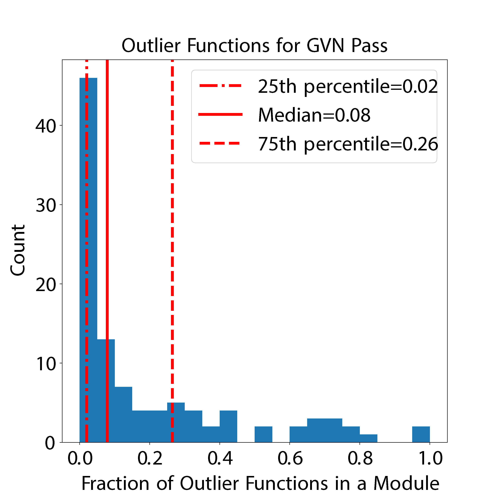

    <h2>Abstract</h2>

Within this walk, we present statistical analyses of the properties of the generated IR, and the optimization pipeline itself. We quantify a number of factors related to the optimization pipeline including which optimizations are run, how long they take, and perform an analysis of the code at the end on a massive corpus of multi-language IR. We anticipate our results to be a starting point for deeper specific investigations on issues like the optimality of the current pass pipelines and help to better understand where compile time is spent. Initial results are presented here but the talk will focus on knowledge filtered out of this data and more we will gather in the meantime.

    <h2>ComPile at a Glance</h2>
    

Broken down into the specific sizes of the content of ComPile in the different LLVM-based languages contained in ComPile:

    

The dataset is filtered for [MIT](https://spdx.org/licenses/MIT.html), [Apache-2.0](https://spdx.org/licenses/Apache-2.0.html), [BSD-3-Clause](https://spdx.org/licenses/BSD-3-Clause-Clear.html), and [BSD-2-Clause](https://spdx.org/licenses/BSD-2-Clause.html) licenses.

> See the _LLVM-IR-Dataset-Utils - Scalable Tooling for IR Datasets_ technical talk on the dataset tooling behind ComPile!

    <h2>Statistical Analyses</h2>
    <h3>Distribution of ComPile's Compile Times</h3>
    
    <h3>Scatter Plot of Compile Times</h3>
    
    <h3>Relative Wall Time Distribution</h3>
    
    <h3>Absolute Time vs. Relative Time</h3>
    
    <h3>Outlier Function Extraction</h3>
    
    
    <h2>Authors</h2>

    

        
        
<a href="https://www.linkedin.com/in/andrew-kallai-a990b41a7">Andrew Kallai</a>

    

    

        
        
<a href="https://www.linkedin.com/in/khoidng">Khoi Nguyen</a>

    

    

        
        
<a href="https://ludger.fyi">Ludger Paehler</a>

    

    

        
        
<a href="https://www.linkedin.com/in/aiden-grossman-40213a248/">Aiden Grossman</a>

    

    

        
        
<a href="https://people.llnl.gov/doerfert1">Johannes Doerfert</a>

    

    

        
        
<a href="https://crpl.cis.udel.edu/sunita/">Sunita Chandrasekaran</a>

    

    <h2>Corresponding Author</h2>
    Johannes Doerfert (<a href="mailto:jdoerfert@llnl.gov">jdoerfert@llnl.gov</a>)

