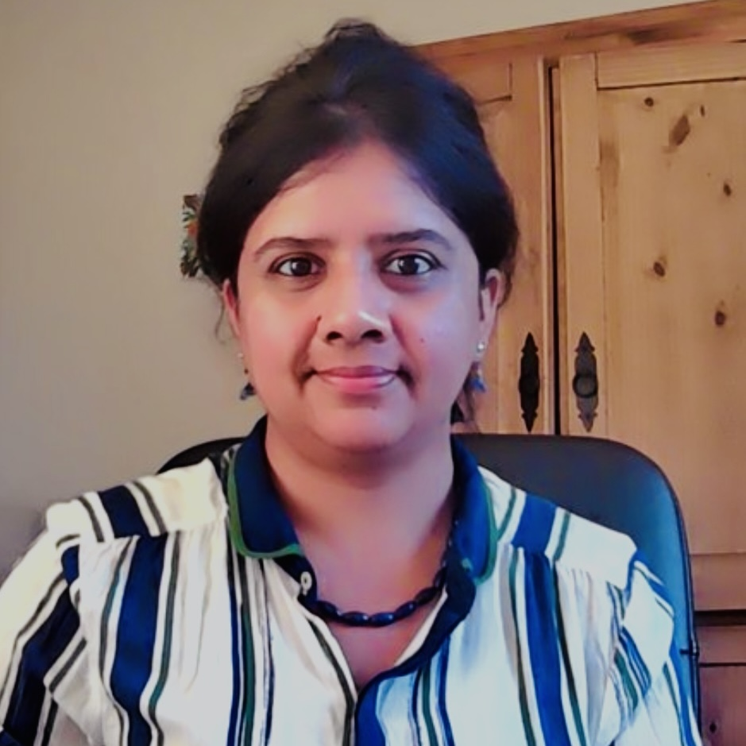

## Abstract

Abstract to go here.

## ComPile at a Glance

Broken down into the specific sizes of the content of ComPile in the different LLVM-based languages contained in ComPile:

The dataset is filtered for [MIT](https://spdx.org/licenses/MIT.html), [Apache-2.0](https://spdx.org/licenses/Apache-2.0.html), [BSD-3-Clause](https://spdx.org/licenses/BSD-3-Clause-Clear.html), and [BSD-2-Clause](https://spdx.org/licenses/BSD-2-Clause.html) licenses.

> See the _LLVM-IR-Dataset-Utils - Scalable Tooling for IR Datasets_ technical talk on the dataset tooling behind ComPile!

## Statistical Analyses

tbd

## Authors

    

        
        
<a href="https://www.linkedin.com/in/andrew-kallai-a990b41a7">Andrew Kallai</a>

    

    

        
        
<a href="https://www.linkedin.com/in/khoidng">Khoi Nguyen</a>

    

    

        
        
<a href="https://ludger.fyi">Ludger Paehler</a>

    

    

        
        
<a href="https://www.linkedin.com/in/aiden-grossman-40213a248/">Aiden Grossman</a>

    

    

        
        
<a href="https://people.llnl.gov/doerfert1">Johannes Doerfert</a>

    

    

        
        
<a href="https://crpl.cis.udel.edu/sunita/">Sunita Chandrasekaran</a>

    

## Corresponding Authors

> Who else should be added here?

* Johannes Doerfert ([jdoerfert@llnl.gov](mailto:jdoerfert@llnl.gov?subject=IRAroundTheWorld))
